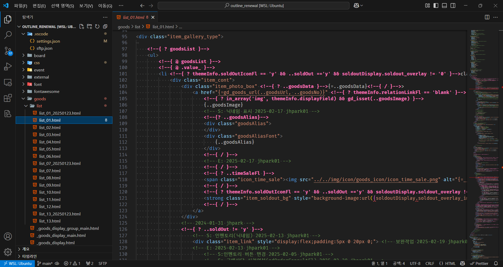

# HTML 고도몰 Comment Semantic Highlighter

### Highlights 고도몰 HTML comments like <!--{ ... }--> using semantic tokens.




### 설치

```bash
git clone https://github.com/plandocs-it/html-godo-token-extension.git
cd html-godo-token-extension
code --install-extension html-godo-comment-semantic-0.1.0.vsix
```


### 이 익스텐션 설치했으면 settings.json에 아래 설정 추가

```json
{
    ...

    "editor.semanticTokenColorCustomizations": {
        "rules": {
            "godoComment": {
                "foreground": "#f472b6",
                "fontStyle": "bold"
            }
        }
    }
}

```
